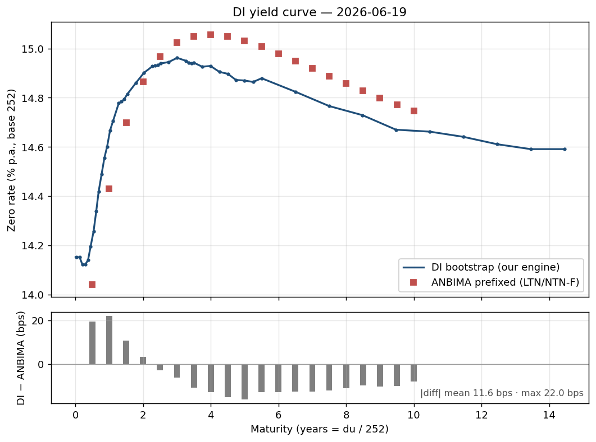

# DI Yield Curve Engine

A market-agnostic yield-curve toolkit, with the **Brazilian DI (pré-fixed) curve**
as its main case. The quant math is implemented from scratch: day count, bootstrap,
interpolation, forwards and risk. **QuantLib is used only as a test oracle**, never
in production code.

The goal is not "plot a curve". It is correct quant math together with production
rigor: layered tests (unit, validation, integration), a QuantLib oracle to 1e-8, a
thin API, and a daily GitHub Action that rebuilds and commits the curve, its risk
profile, and a benchmark.

## The curve



The blue line is our bootstrapped DI curve (one spot per liquid DI1 contract,
extracted from its settlement price). The red squares are the ANBIMA prefixed curve
(a Svensson fit to LTN/NTN-F government bonds), used as an independent benchmark. The
lower panel shows the difference in basis points.

The image is refreshed daily by the Action (it tracks the latest committed curve).
You can also regenerate it locally from the committed CSVs, with no network:

```bash
pip install -e ".[viz]"
python scripts/plot_curve.py
```

### Why it differs from the ANBIMA curve

Both curves describe the same thing, the term structure of nominal BRL rates, but
they are built from different instruments in different markets. A spread of a few to
a few dozen basis points is expected and economically meaningful, not a bug.

The DI curve is bootstrapped from **DI1 futures** settlement prices (B3). DI1 tracks
the accrued interbank rate (CDI, close to Selic), which is the market's expectation
of the average overnight rate. The ANBIMA prefixed curve is a smoothed Svensson fit
to **LTN/NTN-F**, fixed-rate government bonds in the secondary market.

What drives the spread:

1. **Futures vs cash.** DI1 is a daily-margined future with no position funding.
   LTN/NTN-F are cash bonds whose yields embed funding, carry, and the cash/futures
   basis.
2. **Credit, supply and demand.** Sovereign bond yields reflect issuance, captive
   demand (pension funds, banks' liquidity buffers) and tax treatment, none of which
   move the DI future the same way.
3. **Fitting and smoothing.** ANBIMA publishes a 6-parameter Svensson fit to a sparse
   set of bonds. Our DI curve is an exact bootstrap through 40 or more liquid
   contracts, so part of the gap is the smoothing error of the parametric model.
4. **Independent liquidity.** The two markets clear separately, and the relative
   richness or cheapness of specific bonds against the DI strip shows up as basis.

In the latest build the spread is about 12 bps on average and 22 bps at the maximum,
and it has structure: the DI curve sits above ANBIMA at the short end and below it
through the 3 to 10 year belly, crossing near 2.5 years. That sign pattern is the
futures vs sovereign basis, which is exactly what this comparison is meant to
surface. The benchmark exists to document the divergence, not to force the curves to
agree.

## How it works

**1. Data, settlement prices per contract.** `scripts/fetch_di1.py` downloads B3's
`TradeInformationConsolidatedFile` and keeps the DI1 futures (`SgmtNm == FINANCIAL`,
`TckrSymb == DI1<month><year>`). Each contract gives its adjusted price `AdjstdQt`
(the PU) and the adjusted rate `AdjstdQtTax`.

**2. Day count.** ANBIMA calendar via `bizdays`. `du` is counted d0-inclusive and
maturity-exclusive, on a 252 business-day basis. Maturity is the first business day
of the contract month.

**3. Bootstrap, one spot per contract from the PU.** DI1 is zero-coupon (notional
100,000), so each contract is a direct spot point:

```
i = (100000 / PU) ** (252 / du) - 1
```

The short end is anchored at `du = 1` with the overnight rate (CDI from BCB SGS,
best-effort, falling back to the shortest contract's spot if BCB is unavailable).

**4. Interpolation, flat-forward by default.** Constant daily forward between nodes,
which under the 252-exponential convention is exactly log-linear in the discount
factor against `du`. A cubic scheme is available as an option.

**5. Curve object.** `Curve` exposes `df(t)`, `zero(t)`, `forward(t1, t2)`, where `t`
is a `du` or a calendar date.

**6. Risk.** `risk.py` gives parallel DV01 and key-rate DV01 (bump each vertex,
re-interpolate, reprice). The daily job also writes a risk ladder (`risk_<d0>.csv`):
DV01 per vertex of a reference book of one contract at each node.

**7. Benchmark.** `scripts/fetch_anbima_ettj.py` pulls the ANBIMA prefixed ETTJ.
`build_curve.py` compares and writes `benchmark_<d0>.csv` with the difference in bps.

### Validation

The math is checked from independent angles, none of which depend on a ready-made
curve:

* **Round-trip from the PU.** Repricing each contract off the curve recovers B3's
  settlement price to about 3e-11 points on a 100,000 notional.
* **QuantLib oracle.** Discount factors and zero rates match `Business252` plus
  `DiscountCurve` (using the same ANBIMA holidays) to 1e-8.
* **Day-count convention.** Our `du` plus `rate_from_pu(PU)` reproduces B3's own
  settlement rate (`AdjstdQtTax`) to about 0.008 bps across all contracts.
* **Key-rate additivity.** The sum of key-rate DV01s is close to the parallel DV01.

## Repository layout

```
src/yieldcurve/        the library (pure numpy, market-agnostic)
  daycount.py          252, business days, ANBIMA calendar, contract decode
  instruments.py       DI1, PU <-> rate, DF
  bootstrap.py         spot nodes from settlements + overnight anchor
  interpolation.py     flat-forward (default), log-linear DF, cubic
  curve.py             Curve: df(t), zero(t), forward(t1, t2)
  forward.py           forward rates from DFs
  risk.py              DV01, key-rate durations
scripts/               data collection and pipeline (network, lazy imports)
  fetch_di1.py         DI1 settlement prices (B3)
  fetch_anbima_ettj.py ANBIMA prefixed ETTJ (benchmark)
  build_curve.py       fetch, bootstrap, save (with risk and benchmark)
  daily_curve.py       daily orchestrator (backfill, guards, idempotency)
  plot_curve.py        render reports/figures/curve_latest.png
app/main.py            thin FastAPI over the library
tests/                 unit, validation, integration (206 tests)
data/                  raw settlements and dated curves (committed by the Action)
.github/workflows/     ci.yml and daily-curve.yml
```

## Install and run locally

Requires Python 3.10 or newer.

```bash
git clone <repo> && cd di-yield-curve-engine
pip install -e ".[dev]"
```

Optional extras: `data` (pyettj, for the network fetchers), `viz` (matplotlib),
`api` (uvicorn), `oracle` (QuantLib, the test oracle).

### Build a curve

```bash
pip install -e ".[data,viz]"
python scripts/build_curve.py
# offline, from a committed settlements file:
python scripts/build_curve.py --settlements data/raw/settlements_2026-06-19.csv --no-benchmark
```

Outputs land in `data/curves/`: `curve_<d0>.csv`, `risk_<d0>.csv`,
`benchmark_<d0>.csv`, and `latest.csv`.

### Run the API

```bash
pip install -e ".[api]"
uvicorn app.main:app --reload      # docs at http://127.0.0.1:8000/docs
```

```
GET  /curve                          metadata
GET  /curve/zero?du=252              also accepts ?date=2027-01-04
GET  /curve/forward?du1=252&du2=504
POST /risk/dv01   { "cashflows": [ {"du": 252, "amount": 1000000} ] }
```

### Tests and lint

```bash
pytest                                  # 206 tests
pip install -e ".[oracle]"; pytest      # also runs the QuantLib oracle
ruff check src tests scripts app
```

## The daily job

`.github/workflows/daily-curve.yml` runs `scripts/daily_curve.py` on two weekday
crons (about 20:00 and 08:00 BRT). It:

* picks the recent business days that are incomplete (missing the curve or the
  benchmark), a self-healing backfill over the last few days;
* fetches settlements, validates that the returned `refdate` matches the target,
  runs sanity checks, bootstraps the curve, writes the risk ladder, attempts the
  ANBIMA benchmark (best-effort, so a late ANBIMA never blocks the curve), and
  refreshes the plot;
* commits the new files back (`data/curves/`, `data/raw/`, `reports/figures/`, with
  `[skip ci]`). This is the only automatic commit in the project.

If nothing is new (a holiday, or the settlement is not published yet) it exits clean
with no commit.

## License

MIT.
